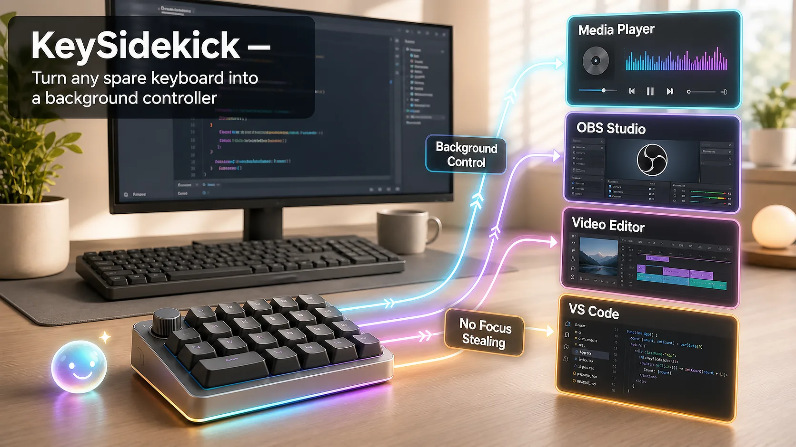

[English](README.md) · [Русский](README.ru.md) · [简体中文](README.zh.md)

# KeySidekick

> 把任意一把备用键盘变成专属的后台助手——控制媒体播放器、DAW、OBS 等应用，同时完全不打扰你正在做的事情。

[](LICENSE)
[](#system-requirements)
[](#building-from-source)

<p align="center"></p>

第二把键盘（或数字小键盘、宏键盘）变成可靠的**副手（sidekick）**——一个或多个应用的专属控制器，在后台运行，永远不会抢走焦点。主键盘正常工作，不受任何影响。你可以随时通过系统托盘、专用按键或内置 Web 仪表盘切换副手控制的对象。

---

## 它解决的问题

你希望某一把特定的键盘控制某一个特定的应用，**并且**它的按键不会进入当前活动窗口——同时能在运行时随时切换它控制哪个应用。

听起来很简单，但 Windows 每一步都在跟你作对：

| 方案 | 区分键盘 | 拦截按键 | 延迟 |
|---|---|---|---|
| `WH_KEYBOARD_LL` hook | ❌ 没有设备 ID | ✅ 可以 | ❌ 阻塞整个系统输入线程 |
| Raw Input（`WM_INPUT`） | ⚠️ 仅当 `hDevice != NULL` | ❌ 只读 | ✅ 无 |
| Interception（内核过滤器） | ✅ | ✅ | ✅ 但是内核驱动，**休眠时有锁死风险** |

还有一个讨厌的陷阱：**廉价 / 复合键盘（键盘 + 触摸板组合）在 Raw Input 中报告 `hDevice == NULL`**，所以连 Raw Input 都无法把它们和主键盘区分开——两者看起来都是匿名的。「Raw Input 识别 + LL hook 拦截」的混合方案随后要么拖慢整个系统，要么产生误判。

## 解决方案

**WinUSB 驱动替换旁路（WinUSB Driver-Replacement Bypass）。** 键盘接口从系统键盘栈中脱离（通过 [Zadig](https://zadig.akeo.ie/) 替换为微软内置的 `WinUSB.sys`）。它的按键完全不再进入 Windows 输入队列——无法到达任何窗口。KeySidekick 通过 WinUSB 直接读取原始 HID 报告，并按当前**配置文件**进行分发。

这绕开了上面所有的限制：
- ✅ 没有 LL 钩子，所以没有系统延迟
- ✅ 即使 `hDevice == NULL` 也能工作（我们直接读取设备，而不是通过 Raw Input）
- ✅ 没有内核过滤驱动——只有微软 WHQL 签名的 WinUSB
- ✅ 休眠/睡眠后依然正常（WinUSB 原生处理 ACPI）

完整的技术深挖见 [`docs/PROBLEM-AND-SOLUTION.md`](docs/PROBLEM-AND-SOLUTION.md)。

---

## 功能特性

- **配置文件（Profiles）** —— 多套配置，运行时随时切换
- **每个配置文件两种模式：**
  - `basic` —— 专用键盘向当前焦点窗口**正常输入**（通过 `SendInput` 重新注入）。当你临时想让它像普通键盘一样使用时很有用。
  - `targeted` —— 按键通过 `PostMessage` 发送到所选应用的窗口，永远不会到达前台；单键映射保留 key-down、Windows 频率重复和 key-up
- **多应用路由** —— 在同一个配置文件中，不同按键可以指向*不同*应用（`!app:Spotify:{Media_Play_Pause}` 发送给 Spotify，其余按键按配置文件执行）
- **按键组合** —— `Ctrl+Shift+1`、`Alt+Q` 等作为触发器（例如 `USAGE_1E+Ctrl+Shift=!switch:aimp`）
- **Web 仪表盘** —— 内置控制面板，位于 `http://127.0.0.1:8765/`：
  - 创建、重命名、复制、删除配置文件（无需编辑 INI）
  - 可视化应用选择器——从运行中的窗口选择目标
  - 带芯片的动作选择器（keys、media、switch、launch、multi-app）
  - 诊断页面（设备/驱动/配置健康状况、最近日志）
  - Help/Setup 页面（引导、故障排查、驱动回滚）
  - 通过 SSE 实时更新（无需手动刷新）
- **实时切换配置文件的方式：**
  - 专用键盘上的**按键**（`!switch:`/`!toggle:` 动作令牌）
  - **系统托盘图标** —— 左键单击 → 仪表盘；右键单击 → 带配置文件和模式指示器的菜单
  - 位于 `127.0.0.1` 的**本地 HTTP API** —— CSRF 保护、支持 SSE
- **可靠性：**
  - 常驻设备循环——即使键盘断开连接，应用也保持运行；空闲时采用事件驱动（无轮询，无操作时零磁盘/CPU 开销）
  - 单实例互斥锁——不会重复启动
  - 注入所有权台账——只释放自己注入的按键，绝不触碰主键盘的修饰键
  - 原子化配置写入——临时文件 → 校验 → 带备份替换
  - 休眠/睡眠安全——唤醒后自动重连
  - 目标应用窗口找不到时自动启动目标应用
- **随 Windows 自启动** —— 通过仪表盘或 API 管理

## 便携模式（装在 U 盘里随身携带）

KeySidekick 完全便携：`sidekick.exe` 把 `config.ini` 和日志保存在**自己旁边**（exe 所在目录，可回退到当前目录）。把整个文件夹复制到 U 盘，配置、目标和映射随行。在另一台电脑上：

1. 从 U 盘运行 `sidekick.exe`。
2. 打开仪表盘 → **+ Setup keyboard**：键盘以普通设备列出 — 更换一次驱动（**Swap automatically**，UAC 提示仅在此刻出现），或直接运行 `sidekick.exe --driver swap vid_xxxx&pid_yyyy`。
3. 完成 — 该 VID/PID 的配置已在配置文件中并立即生效。键盘插入其他 USB 端口会被自动识别，一键「Apply driver again」即可恢复。

任意机器上回滚：`sidekick.exe --driver restore vid_xxxx&pid_yyyy`（或设备管理器 → 卸载设备 → 重新插入）。

**完全离线。** KeySidekick 不建立**任何网络连接**：整个程序唯一的套接字是绑定在 `127.0.0.1` 上的本地仪表盘。无遥测、无云同步、数据不出本机。云/服务器功能刻意不在范围内。

## 已知限制（使用前请阅读）

- **basic 模式在游戏 / 反作弊环境中无效。** `SendInput` 会用 `LLKHF_INJECTED` 标记事件；CS:GO、Valorant 以及 EAC 保护的游戏会检测并忽略（或封禁）注入的输入。basic 模式适用于浏览器、编辑器、办公软件、终端。如果需要游戏兼容性，键盘必须保持在原生 HID 驱动上（不要使用本工具的 basic 模式——请使用 `targeted` 配置文件，或通过 Zadig 恢复驱动）。
- **targeted 按住只适用于消息驱动型应用。** 后台按住/重复以 `WM_KEYDOWN`/`WM_KEYUP` 形式投递。轮询 `GetAsyncKeyState`、DirectInput 或 Raw Input 的应用可能会忽略它。
- **仅支持 Windows 10（1809+）。** 使用 WinUSB 和现代 SetupAPI。
- **需要一次性 Zadig 设置** —— 替换键盘接口的驱动（可逆；见 [ZADIG_INSTRUCTIONS.md](ZADIG_INSTRUCTIONS.md)）。

---

## 下载 / 安装

1. 从项目的 GitHub Releases 页面下载最新版本的 ZIP 压缩包（文件名为 `KeySidekick-<version>.zip`）。
2. **核对 ZIP 的 SHA256 校验和** 与发布时公布的值是否一致。
3. 将压缩包解压到任意位置——无需安装——然后运行 `run.bat`（或直接从解压目录运行 `sidekick.exe`）。
4. 在浏览器中打开 http://127.0.0.1:8765/ 。
5. 使用 **+ Setup keyboard** 完成一次性的 Zadig 驱动替换，然后用 **+ Pad template** 创建你的第一个控制面板。

完整操作指南见 [快速开始](#quickstart)。

---

## 快速开始

### 1. 获取二进制文件

从 [Releases](#download--install) 页面下载最新的发布压缩包，**或者**从源码构建（见下文）。

### 2. 找到你的键盘并替换驱动（一次性）

打开仪表盘（`http://127.0.0.1:8765/`）→ **+ Setup keyboard**。在 Zadig 之前，你的键盘是**普通**键盘，向导从这里开始：

1. 列出**所有**输入设备——键盘、鼠标、带键盘的智能设备——无论驱动如何，并显示其状态（`Normal keyboard (HidUsb)` 与 `WinUSB — ready`）。
2. **按下一个按键来识别**你的键盘 VID/PID（Raw Input，对普通键盘同样有效）。对于复合设备，Windows 可能无法提供逐键识别——那就按名称 / VID / PID 从列表中选择。
3. **替换前的准备**：确认键盘可以正常输入，启用 KeySidekick 自启动（**替换后键盘只有在 sidekick.exe 运行时才会输入**），保留备用输入方式，并确认 MI_00 是键盘（*不要*动 MI_01——那是鼠标/触摸板）。
4. 针对你的确切 VID/PID 的分步 **Zadig 指南**——向导会监视设备切换到 WinUSB，并警告 phantom 副本陷阱（如果仍然正常输入，则执行 `Reinstall Driver`）。
5. **验证** KeySidekick 能捕获按键，然后将键盘设为活动设备（把 `DeviceVIDPID` 写入配置）。

手动 Zadig 等效步骤：

1. 从 <https://zadig.akeo.ie/> 下载 **Zadig** 并**以管理员身份**运行。
2. **Options → List All Devices** ✓（勾选）。
3. 找到键盘的 `MI_00`（键盘）接口——例如 `USB Input Device (VID xxxx PID yyyy) [MI 00]`。**不要**选 `MI_01`（那通常是触摸板/鼠标）。
4. 目标驱动：**WinUSB (Microsoft)**（用箭头按钮选择）。
5. 点击 **Replace Driver** → 等待「SUCCESS」。

完整步骤 + 如何避免弄错接口 + 回滚：[`ZADIG_INSTRUCTIONS.md`](ZADIG_INSTRUCTIONS.md)。

### 3. 配置

将 `src/config.example.ini` 复制为 `src/config.ini` 并编辑。最小配置（当前 **v3 模式**——`SchemaVersion=3`，配置文件位于 `[Profile.<name>]` 段下）：

```ini
[General]
SchemaVersion=3
DeviceVIDPID=vid_xxxx&pid_yyyy     ; your device (see Zadig / Device Manager)
DefaultProfileId=basic
HTTPPort=8765
HTTPEnabled=1
TrayEnabled=1
EnableLog=1

[Application.aimp]
Name=AIMP
TargetClass=TAIMPMainForm           ; window class of the target app
TargetExe=AIMP.exe
TargetPath=C:\\Program Files (x86)\\AIMP\\AIMP.exe
AutoStart=1

[Profile.aimp]
Mode=targeted
ApplicationId=aimp                  ; link to [Application.aimp] above

[Profile.aimp.Mappings]
USAGE_14={F1}                       ; physical Q → F1
USAGE_1E=1                          ; physical 1 → 1
USAGE_29=!switch:basic              ; Esc → switch to basic (types normally)
USAGE_1E+Ctrl+Shift=!switch:aimp    ; Ctrl+Shift+1 → switch to aimp
```

在 Zadig 或通过 `Get-PnpDevice -Class Keyboard` 查找设备的 VID/PID。用 [Spy++](https://learn.microsoft.com/en-us/visualstudio/debugger/introducing-spy-increment) 或 PowerShell 查找目标应用的窗口类（见 [FAQ](docs/FAQ.md)）。

### 4. 运行

```
cd src
run.bat
```

或直接运行：`sidekick.exe`（在包含 `config.ini` 的目录中）。

### 5. 控制

- **Web 仪表盘** —— 在浏览器中打开 `http://127.0.0.1:8765/`。左键单击托盘图标即可打开。
  - 创建、重命名、复制、删除配置文件（无需编辑 INI）
  - **+ Agent pad** —— 一键预设：把备用键盘变成 AI 编码控制面板（Codex / Claude / Cursor / Devin / ChatGPT）：接受、取消、分支、侧边栏、语音、提示历史、媒体——就像 Stream Deck / Codex Micro，但映射到你现有的键盘上。
  - **Pad templates（use-case）** —— 现成的 F1–F12 配置文件：媒体、OBS、会议、PowerPoint、**REAPER**、**DaVinci Resolve**、**Ableton Live**、**Adobe Premiere**、**Lightroom Classic**（DAW/视频快捷键已对照官方手册核对）。
  - **Live** —— 当前配置文件按键网格 + 刚触发动作的实时流。点击任意单元格或流中的任意条目即可**立即触发动作**（`POST /api/v1/action/fire`）——无需实体按键。
  - **Typed Action Builder** —— 模态动作编辑器（替代浏览器 `prompt()`）：key/media/macro/switch/launch/send-to-app 芯片、实时预览、选择运行中的窗口。
  - **首次运行引导** —— 空仪表盘提供三条路径（Pad template / Create profile / Keyboard setup）；「Start here」可随时返回选择。
  - 动作选择器中的 **Macros** 选项卡 —— 命名的组合/序列示例（`{Ctrl+B}`、`{Ctrl+M}`、`{/}{Enter}`、……）。支持组合键和多键序列作为动作：`{Ctrl+Shift+F}`、`{Up}{Enter}`。
  - 从运行中的窗口进行可视化应用选择
  - Diagnostics 和 Help/Setup 页面
  - 通过 SSE 实时更新（无需手动刷新）
- **托盘图标** —— 左键单击 → 打开仪表盘；右键单击 → 带配置文件和模式指示器的上下文菜单。
- **HTTP API**（仅回环，CSRF 保护）：
  ```bash
  curl http://127.0.0.1:8765/api/profiles        # list profiles
  curl http://127.0.0.1:8765/api/v1/state        # unified state snapshot
  curl http://127.0.0.1:8765/api/v1/diagnostics  # health check
  curl http://127.0.0.1:8765/api/v1/hid          # all input devices + driver state (ready / needs-driver / ordinary)
  curl http://127.0.0.1:8765/api/v1/input/identify   # last keypress source (Raw Input; POST resets first)
  curl http://127.0.0.1:8765/api/v1/presets     # AI-agent pad catalog
  curl http://127.0.0.1:8765/api/v1/activity    # recent fired actions (Live screen)
  curl -X POST http://127.0.0.1:8765/api/v1/action/fire \
    -H "Content-Type: application/json" -H "X-KeySidekick-Token: $TOKEN" \
    -d '{"action":"{Media_Play_Pause}","usage":42,"profile":""}'  # fire an action like a pressed key
  ```
  切换配置文件 / 激活设备 / 应用代理预设（需要来自仪表盘的 CSRF 令牌）：
  ```bash
  TOKEN=$(curl -s http://127.0.0.1:8765/ | grep -o 'CSRF_TOKEN="[^"]*"' | grep -o '"[^"]*"' | tr -d '"')
  curl -X POST http://127.0.0.1:8765/api/profile/activate -H "Content-Type: application/json" -H "X-KeySidekick-Token: $TOKEN" -d '{"name":"aimp"}'
  curl -X POST http://127.0.0.1:8765/api/v1/devices/activate -H "Content-Type: application/json" -H "X-KeySidekick-Token: $TOKEN" -d '{"vidpid":"vid_xxxx&pid_yyyy"}'
  curl -X POST http://127.0.0.1:8765/api/v1/preset/apply -H "Content-Type: application/json" -H "X-KeySidekick-Token: $TOKEN" -d '{"agentId":"codex","name":"Codex pad"}'
  ```
  > **开发者注意：** `tests/http_integration_tests.sh` 针对运行中的实例执行；它会对 `src/config.ini` 做快照并在退出时自动恢复——无需手动备份。
- **按键** —— 你在当前配置文件中映射到 `!switch:`/`!toggle:` 的任何按键。

---

## 从源码构建

需要 [MinGW-w64](https://www.mingw-w64.org/) g++（例如来自 [MSYS2](https://www.msys2.org/) 或独立构建）。不需要 Windows SDK 路径——MinGW 自带 `winusb.h`/`setupapi.h`。

```
cd src
build.bat
```

`src\build.bat` 执行完整构建：通过 `web/generate_dashboard.ps1` 从 `web/` 重新生成内嵌 Web 仪表盘，用 `windres` 编译图标资源（`resources.rc` → `resources.o`），然后链接 `sidekick.exe`（全部 11 个 C++ 源文件 + `resources.o`、WinUSB/SetupAPI/user32/ws2_32/… 库）和 `probe_device.exe`。它首先查找 `C:\MinGW64\bin\g++.exe`，然后回退到 PATH 中的 `g++`——只要能找到 MinGW-w64 g++，两者都行。

`probe_device.exe` 是一个诊断工具——Zadig 替换后运行它，可导出设备的接口 GUID、端点和 HID 报告描述符（确认标准的 8 字节键盘报告）。

## 系统要求

- Windows 10 版本 1809 或更高（x64）
- 一把空闲的 USB 键盘，且你愿意把它的 `MI_00` 接口放到 WinUSB 驱动上
- 一次性驱动替换需要 [Zadig](https://zadig.akeo.ie/)
- MinGW-w64 g++（仅从源码构建时需要）

## 文档

- [`presentation.html`](presentation.html) —— 独立三语落地页（EN/РУС/中文）：问题、解决方案、功能、Pad 模板、API
- [`ZADIG_INSTRUCTIONS.md`](ZADIG_INSTRUCTIONS.md) —— 一次性驱动替换的分步指南（包括如何撤销）
- [`docs/PROBLEM-AND-SOLUTION.md`](docs/PROBLEM-AND-SOLUTION.md) —— 技术故事：Windows 输入架构、为什么 `hDevice == NULL`、为什么 LL 钩子会卡顿、为什么 Interception 有风险、为什么 WinUSB 更优
- [`docs/FAQ.md`](docs/FAQ.md) —— 常见问题与修复
- [`docs/HID-USAGE-TABLE.md`](docs/HID-USAGE-TABLE.md) —— 用于 INI 映射的 HID 键盘/小键盘 Usage ID 表

## 工作原理（一段话）

键盘的 HID 接口从 `hidusb.sys → kbdhid.sys → kbdclass.sys` 重新绑定到微软的 `WinUSB.sys`。没有绑定键盘类驱动，它的按键永远不会进入 Windows 输入队列——对前台不可见。KeySidekick（`sidekick.exe`）通过 WinUSB API 打开设备，从 interrupt IN 端点异步读取 8 字节 HID 键盘报告，对 key-down/key-up 状态做差分，查找当前配置文件，并把每个按键分发为一次性动作（`!switch`、`!app:`、……），或作为通过 `PostMessage` 发送到目标窗口的按住按键生命周期（`targeted` 模式），或通过 `SendInput` 重新注入系统输入流（`basic` 模式）。targeted 模式的单键映射使用 Windows 键盘延迟/速度进行重复……

## 致谢

- **[Zadig](https://zadig.akeo.ie/)** 由 [Pete Batard / Akeo](https://github.com/pbatard/libwdi) 开发——让 WinUSB 设置变成一键操作的驱动替换工具（LGPL）。
- **Microsoft WinUSB**（`winusb.sys`）——整个方案所依赖的 WHQL 签名用户态 USB 驱动。
- **[USB HID Usage Tables](https://usb.org/sites/default/files/hut1_22.pdf)**（USB-IF）——键盘 Usage ID 的权威来源。

## 参与贡献

欢迎提交 issue 和 pull request。较大的改动请先开 issue 讨论。提交 PR 前请使用 `src/build.bat` 构建并确认[检查清单](#building-from-source)。

## 许可证

版权所有 © 2026。基于 **[GPL-3.0](LICENSE)** 许可。

本项目使用但不捆绑 [Zadig](https://zadig.akeo.ie/)（LGPL）——用户需单独下载。路由器链接到 Microsoft Windows 系统库（`winusb`、`setupapi`、`ws2_32` 等），这些库不受本许可证约束。
